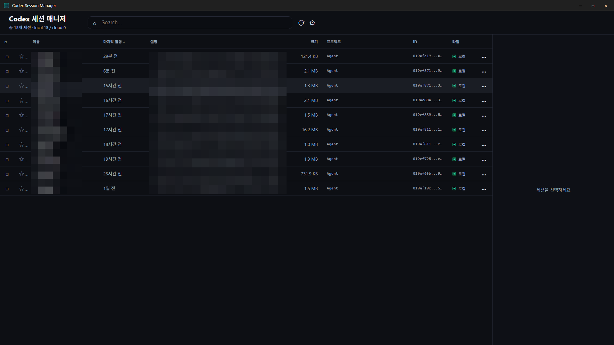

# Codex Session Manager

OpenAI Codex CLI 세션을 데스크톱에서 보고, 이름을 붙이고, 검색하고, 터미널에서 이어갈 수 있게 해주는 Tauri 앱입니다.

이 저장소는 [glowElephant/claude-session-manager](https://github.com/glowElephant/claude-session-manager)를 fork해서 Codex용으로 이식한 프로젝트입니다.

Built with **Tauri 2 + Rust + React + TypeScript + Tailwind + shadcn/ui**.

[Download latest release](https://github.com/nowJDev/codex-session-manager/releases/tag/v0.5.1) · [Report an issue](https://github.com/nowJDev/codex-session-manager/issues/new)



## Fork Lineage

`codex-session-manager` started as a fork of [glowElephant/claude-session-manager](https://github.com/glowElephant/claude-session-manager). The first Codex-oriented release line is `v0.5.x`.

`v0.5.0` was kept as the first port tag for history, but its release workflow was superseded by `v0.5.1` after updating GitHub Actions to Node 24 for `pnpm 11.8.0`. Use `v0.5.1` or newer for installers.

## Features

- **Codex 세션 스캔**: `~/.codex/sessions/YYYY/MM/DD/*.jsonl`과 `~/.codex/archived_sessions`를 읽습니다.
- **Codex JSONL 파싱**: `session_meta`, `turn_context`, `event_msg`, `response_item` 레코드를 관대하게 읽고 모르는 레코드는 무시합니다.
- **검색과 정렬**: 이름, 설명, 프로젝트, 세션 ID, 첫 사용자 메시지 기준으로 빠르게 찾습니다.
- **이름/설명/즐겨찾기**: 앱 전용 메타데이터는 `~/.codex-sessions/config.json`에 저장합니다.
- **빠른 resume**: 더블클릭 또는 메뉴로 `codex resume <session-id>`를 새 터미널에서 실행합니다.
- **Archive / Unarchive**: 메뉴에서 `codex archive <session-id>`와 `codex unarchive <session-id>`를 실행합니다.
- **안전한 삭제**: 삭제 액션은 파일 직접 삭제보다 `codex delete <session-id>`를 우선 사용합니다.
- **Resume 옵션**: `--dangerously-bypass-approvals-and-sandbox`, `--debug`, `--verbose`와 자유 입력 플래그를 지원합니다.
- **환경 진단**: Codex CLI 위치와 사용 가능한 터미널을 설정 화면에서 확인합니다.
- **클라우드 동기화**: Google Drive 등 로컬 동기화 폴더 아래 `Codex Sessions` 폴더에 JSONL과 `.meta.json`을 저장합니다.
- **자동 요약**: 로컬 `codex exec`를 사용해 이름/설명을 생성합니다. 이 기능은 Codex CLI 인증 상태에 의존합니다.

## Requirements

- Node.js 24+ for CI and release builds that use `pnpm 11.8.0`.
- pnpm.
- Rust toolchain.
- Tauri 2 platform prerequisites.
- [OpenAI Codex CLI](https://github.com/openai/codex) on `PATH`.

## Installers

The current release is [Codex Session Manager v0.5.1](https://github.com/nowJDev/codex-session-manager/releases/tag/v0.5.1).

| Platform | Asset |
|---|---|
| Windows | `Codex.Session.Manager_0.5.1_x64-setup.exe` or `Codex.Session.Manager_0.5.1_x64_en-US.msi` |
| macOS Apple Silicon | `Codex.Session.Manager_0.5.1_aarch64.dmg` |
| Linux | `.deb`, `.rpm`, or `.AppImage` |

## From Source

```bash
git clone https://github.com/nowJDev/codex-session-manager.git
cd codex-session-manager
pnpm install

# Dev mode
pnpm tauri dev

# Production build
pnpm tauri build
```

Installers land in `src-tauri/target/release/bundle/`.

## Configuration

앱 설정은 `~/.codex-sessions/config.json`에 저장됩니다.

```json
{
  "sessions": {
    "abc123-uuid": {
      "name": "my-feature",
      "description": "Working on the new auth flow",
      "autoSummary": "Refactoring auth middleware",
      "storageType": "local",
      "updatedAt": "2026-04-15T..."
    }
  },
  "settings": {
    "locale": "ko",
    "cloudPath": "G:/My Drive/Codex Sessions",
    "extraProjectDirs": ["D:/other/.codex/sessions"],
    "excludedScanPaths": ["temporary-bot-session"]
  }
}
```

| Variable | Purpose |
|---|---|
| `CODEX_HOME` | Codex 홈 디렉터리를 직접 지정합니다. 기본값은 `~/.codex`입니다. |
| `CODEX_SESSION_HOME` | 테스트와 CLI 격리 실행용 홈입니다. `CODEX_HOME`이 없을 때 `<home>/.codex`를 사용합니다. |
| `CODEX_CLI` | `codex` 실행 파일 경로를 직접 지정합니다. |
| `GIT_BASH` | Windows에서 `git-bash.exe` 경로를 직접 지정합니다. |
| `WINDOWS_TERMINAL` | Windows에서 `wt.exe` 경로를 직접 지정합니다. |

## Architecture

```text
src-tauri/
├── src/
│   ├── scanner.rs          # Codex sessions/archived_sessions 스캔 + JSONL 파싱
│   ├── config.rs           # ~/.codex-sessions/config.json 읽기/쓰기
│   ├── cloud.rs            # 클라우드 폴더 업로드/체크아웃/체크인
│   ├── terminal.rs         # 터미널 감지 + codex resume 명령 생성
│   ├── environment.rs      # Codex CLI + 터미널 진단
│   ├── resume.rs           # 터미널 실행
│   ├── summary.rs          # codex exec 기반 자동 요약
│   └── types.rs            # Session / Config / Settings 타입
├── tests/integration.rs
└── Cargo.toml

src/
├── App.tsx
├── components/
├── lib/ipc.ts
└── i18n/{en,ko}.json
```

## Development

```bash
# Rust tests
cd src-tauri
cargo test -- --test-threads=1

# Frontend build
cd ..
pnpm build
```

`session-cli`는 GUI 없이 백엔드 동작을 확인하는 하네스입니다.

```bash
cd src-tauri
cargo build --bin session-cli
./target/debug/session-cli paths
./target/debug/session-cli list
./target/debug/session-cli check-env
./target/debug/session-cli resume-plan <session-id> [cwd]
```

## Bug Reports

디버그 로그는 다음 위치에 남습니다.

- Windows: `%USERPROFILE%\.codex-sessions\debug.log`.
- macOS/Linux: `~/.codex-sessions/debug.log`.

문제가 생기면 앱의 설정 화면에서 로그 마지막 부분을 복사한 뒤 [GitHub Issues](https://github.com/nowJDev/codex-session-manager/issues/new)에 등록해 주세요.

## License

MIT — see [LICENSE](./LICENSE).
